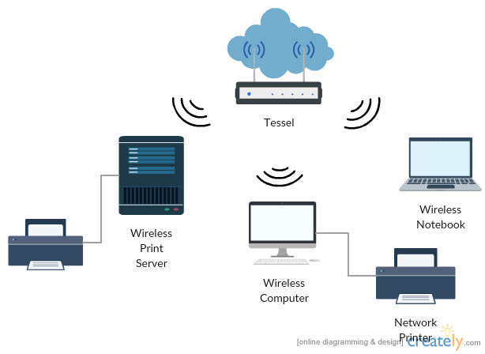

{::options parse_block_html="true" /}

# Making Tessel An Access Point

A typical WiFi setup consists of a couple of devices: a modem, which is connected by wire to the internet, and a wireless access point (also called a WAP or router), wired to the modem, which directs requests and responses between every device on the network.

As explained in [wifi tutorial](/wifi.html), Tessel 2 can easily connect to wifi networks using the command line tool. If your computer is connected to the same WAP as the Tessel, then the two devices can talk to each other. This is how we push code to Tessel over LAN (local area network).

The connection setup looks about like this:

This is fine and dandy if we want to use Tessel in a place where there's a modem and WAP already set up, but what happens when that's not possible?

We can't access the Internet without a modem, but we can create a LAN connection between devices by turning Tessel 2 into a WAP. Devices on the network can all talk to each other, like this:

This tutorial shows you to turn Tessel into a wireless access point, thus creating your own local network.

Now that our server is in place, let's get our access point set up. In the terminal, run the following command:

`t2 ap -n MyTessel`

This will make an open, or password-less, wifi network called MyTessel. If you open the wifi setting of your computer or a separate device like a smartphone or tablet, and scan for new devices, you should be able to see and connect to this new network. For info about making a secure network, take a look at [the cli docs](https://tessel.io/docs/cli#usage). 

**Bonus:** Create an network that requires a password.

  <a href="wifi.html" class="bottomButton button">Prev: Wifi</a>

  <a href="blinky.html" class= "bottomButton right button">Next: Blinky</a>

