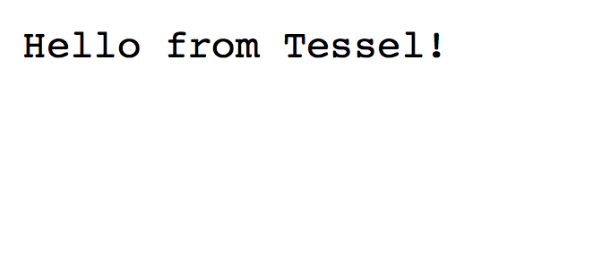
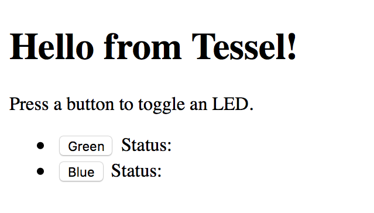

{::options parse_block_html="true" /}

# Build A Portable Web Server

Most web applications are served from remote machines in data centers miles and miles away from the devices that are using them. Because we're used to high-speed internet connections, that distance can seem trivial and unnoticeable. 

The Tessel 2 can run a server and deliver web applications to locally connected devices. It's quicker than those remote machines due to the immediate distance between the Tessel and devices connected to it. By the end of this article, we'll start a server on the Tessel and serve a web application that controls the Tessel LEDs through a local network.

By the end of this article, we'll be able to control the Tessel LEDs through a web app served by the Tessel.

In your command line, make a folder for your Tessel code, then initialize a Tessel project in that folder by running each of the following commands in the terminal:

`mkdir tessel-router`

`cd tessel-router`

`t2 init`

Rename the “index.js” file you’ve just created to “ap.js”, then copy and paste the below script over the existing text:


// Import the interface to Tessel hardware
var tessel = require('tessel');
// Load the http module to create an http server.
var http = require('http');

// Configure our HTTP server to respond with "Hello from Tessel!" to all requests.
var server = http.createServer(function (request, response) {
  response.writeHead(200, {"Content-Type": "text/plain"});
  response.end("Hello from Tessel!\n");
});

// Listen on port 8080, IP defaults to 192.168.1.101. Also accessible through [tessel-name].local
server.listen(8080);

// Put a friendly message in the terminal
console.log("Server running at http://192.168.1.101:8080/");



Now that our server is in place, let's get our access point set up. In the terminal, run the following command:

`t2 ap -n TesselRouter`

If you haven't read about creating access points yet, check out the [access point tutorial](/ap.html). After connecting to TesselRouter, run the following command in your terminal:

`t2 run ap.js`

When "Server running at http://192.168.1.101:8080/" appears in the terminal, connect to that URL (or http://tessel.local:8080/, replacing "tessel" with the name of your Tessel) in a web browser of the device connected to the TesselRouter network.

Now let's take it up a notch by adding some interactivity between the web page and the Tessel!

Let's start this next part by building out the web page we want Tessel to send to your web browser. 

Create a file called `index.html` in your project directory and open it up in your preferred text editor to add the initial html:


<!DOCTYPE html>
<html lang="en">
<head>
  <meta charset="UTF-8">
  <title>Tessel Web App</title>
</head>
<body>
  <h1>Hello from Tessel!</h1>
  
Press a button to toggle an LED.

  <ul>
    <li>
      <button class="led-button" data-led="2">Green</button>
      Status: 
    </li>
    <li>
      <button class="led-button" data-led="3">Blue</button>
      Status: 
    </li>
  </ul>
</body>
</html>


Open that file in the browser to see the UI for this web app.

  

  
  

  

  Add the following JavaScript before `</body>` tag:

  
  
  

  Now let's check out the server again to finish up the project. 

  Replace the code in `ap.js` with the following:


  // These two dependencies remain the same
  var tessel = require('tessel');
  var http = require('http');

  // Require two other core Node.js modules
  var fs = require('fs');
  var url = require('url');

  var server = http.createServer(function (request, response) {
    // Break up the url into easier-to-use parts
    var urlParts = url.parse(request.url, true);

    // Create a regular expression to match requests to toggle LEDs
    var ledRegex = /leds/;

    if (urlParts.pathname.match(ledRegex)) {
      // If there is a request containing the string 'leds' call a function, toggleLED
      toggleLED(urlParts.pathname, request, response);
    } else {
      // All other request will call a function, showIndex
      showIndex(urlParts.pathname, request, response);
    }
  });

  // Stays the same
  server.listen(8080);

  // Stays the same
  console.log('Server running at http://192.168.1.101:8080/');

  // Respond to the request with our index.html page
  function showIndex (url, request, response) {
    // Create a response header telling the browser to expect html
    response.writeHead(200, {"Content-Type": "text/html"});

    // Use fs to read in index.html
    fs.readFile(__dirname + '/index.html', function (err, content) {
      // If there was an error, throw to stop code execution
      if (err) {
        throw err;
      }

      // Serve the content of index.html read in by fs.readFile
      response.end(content);
    });
  }

  // Toggle the led specified in the url and respond with its state
  function toggleLED (url, request, response) {
    // Create a regular expression to find the number at the end of the url
    var indexRegex = /(\d)$/;

    // Capture the number, returns an array
    var result = indexRegex.exec(url);

    // Grab the captured result from the array
    var index = result[1];

    // Use the index to refence the correct LED
    var led = tessel.led[index];

    // Toggle the state of the led and call the callback after that's done
    led.toggle(function (err) {
      if (err) {
        // Log the error, send back a 500 (internal server error) response to the client
        console.log(err);
        response.writeHead(500, {"Content-Type": "application/json"});
        response.end(JSON.stringify({error: err}));
      } else {
        // The led was successfully toggled, respond with the state of the toggled led using led.isOn
        response.writeHead(200, {"Content-Type": "application/json"});
        response.end(JSON.stringify({on: led.isOn}));
      }
    });
  }


In order to make code pushing more efficient, Tessel only pushes the entry point file and its Node dependencies by default. Since index.html is not included in this default push, we'll need to explicitly require it with a .tesselinclude file. (Read more about project files [here](https://tessel.io/docs/cli#usage))

Create a new file called .tesselinclude and copy and paste the following:


index.html


Finally, let's fire up our server again by running:

`t2 run ap.js`

Once the server is running, connect to the URL in the web browser. 

Click on the buttons to toggle the lights.

Here is a demo video:

<video src="https://dl.dropboxusercontent.com/u/74986127/tessel-router-demo.mp4" controls loop class="small-12" >Video not available at the moment.</video>

**Bonus:** Add a way to toggle the red LED as well.

  <a href="ap.html" class="bottomButton button">Prev: Access Point</a>

  <a href="gpio.html" class= "bottomButton right button">Next: Beyond modules</a>

